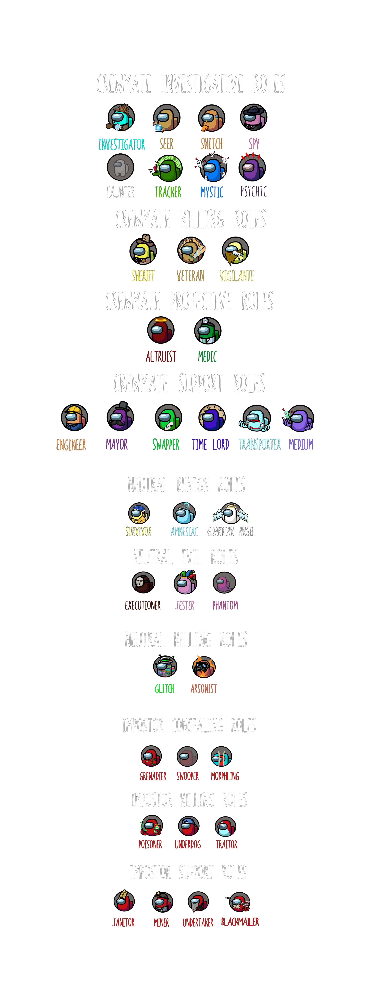

 ## *Note. This repository is a continuation of Town Of Us, updated by -H to add in a few more roles, loads of bug fixes and many more options. Source code is added to each release

An Among Us mod that adds a bunch of roles, modifiers and game settings.

# Contents
**Crewmate Roles**
- [Altruist](#altruist)
- [Chameleon](#chameleon)
- [Engineer](#engineer)
- [Investigator](#investigator)
- [Lovers](#lovers)
- [Mayor](#mayor)
- [Medic](#medic)
- [Seer](#seer)
- [Sheriff](#sheriff)
- [Snitch](#snitch)
- [Spy](#spy)
- [Swapper](#swapper)
- [Time Lord](#time-lord)
- [Tracker](#tracker)
- [Vigilante](#vigilante)

**Neutral Roles**
- [Arsonist](#arsonist)
- [Cannibal](#cannibal)
- [Executioner](#executioner)
- [The Glitch](#the-glitch)
- [Jester](#jester)
- [Shifter](#shifter)

**Ghost Roles**
- [Phantom](#phantom)

**Impostor Roles**
- [Assassin](#assassin)
- [Camouflager](#camouflager)
- [Framer](#framer)
- [Freezer](#freezer)
- [Grenadier](#grenadier)
- [Janitor](#janitor)
- [Miner](#miner)
- [Morphling](#morphling)
- [Poisoner](#poisoner)
- [Puppeteer](#puppeteer)
- [Swooper](#swooper)
- [Underdog](#underdog)
- [Undertaker](#undertaker)

**Modifiers**
- [Bait](#bait)
- [Blind](#blind)
- [Button Barry](#button-barry)
- [Child](#child)
- [Diseased](#diseased)
- [Drunk](#drunk)
- [Giant](#giant)
- [Lagger](#lagger)
- [Lagger Speed](#laggerspeed)
- [Tiebreaker](#tiebreaker)
- [Torch](#torch)
- [Volatile](#volatile)

-----------------------
# Releases
| Among Us - Version| Mod Version | Link |
|----------|-------------|-----------------|
| 2021.6.30s & 2021.6.30e & 2021.7.20e | v4.0.15 | [Download](https://github.com/ItsTheNumberH/Town-Of-H/releases/download/v4.0.15/TownOfUs.dll) |
| 2021.6.30s & 2021.6.30e & 2021.7.20e | v4.0.14 | [Download](https://github.com/ItsTheNumberH/Town-Of-H/releases/download/v4.0.14/TownOfUs.dll) |
| 2021.6.30s & 2021.6.30e & 2021.7.20e | v4.0.13 | [Download](https://github.com/ItsTheNumberH/Town-Of-H/releases/download/v4.0.13/TownOfUs.dll) |
| 2021.6.30s & 2021.6.30e & 2021.7.20e | v4.0.12 | [Download](https://github.com/ItsTheNumberH/Town-Of-H/releases/download/v4.0.12/TownOfUs.dll) |
| 2021.6.30s & 2021.6.30e & 2021.7.20e | v4.0.11 | [Download](https://github.com/ItsTheNumberH/Town-Of-H/releases/download/v4.0.11/TownOfUs.dll) |
| 2021.6.30s & 2021.6.30e & 2021.7.20e | v4.0.10 | [Download](https://github.com/ItsTheNumberH/Town-Of-H/releases/download/v4.0.10/TownOfUs.dll) |
| 2021.6.30s & 2021.6.30e & 2021.7.20e | v4.0.9 | [Download](https://github.com/ItsTheNumberH/Town-Of-H/releases/download/v4.0.9/TownOfUs.dll) |
| 2021.6.30s & 2021.6.30e & 2021.7.20e | v4.0.8 | [Download](https://github.com/ItsTheNumberH/Town-Of-H/releases/download/v4.0.8/TownOfUs.dll) |
| 2021.6.30s & 2021.6.30e & 2021.7.20e | v4.0.7 | [Download](https://github.com/ItsTheNumberH/Town-Of-H/releases/download/v4.0.7/TownOfUs.dll) |
| 2021.6.30s & 2021.6.30e & 2021.7.20e | v4.0.6 | [Download](https://github.com/ItsTheNumberH/Town-Of-H/releases/download/v4.0.6/TownOfUs.dll) |
| 2021.6.30s & 2021.6.30e & 2021.7.20e | v4.0.5 | [Download](https://github.com/ItsTheNumberH/Town-Of-H/releases/download/v4.0.5/TownOfUs.dll) |
| 2021.6.30s & 2021.6.30e & 2021.7.20e | v4.0.4 | [Download](https://github.com/ItsTheNumberH/Town-Of-H/releases/download/v4.0.4/TownOfUs.dll) |
| 2021.6.30s & 2021.6.30e & 2021.7.20e | v4.0.3 | [Download](https://github.com/ItsTheNumberH/Town-Of-H/releases/download/v4.0.3/TownOfUs.dll) |
| 2021.6.30s & 2021.6.30e & 2021.7.20e | v4.0.2 | [Download](https://github.com/ItsTheNumberH/Town-Of-H/releases/download/v4.0.2/TownOfUs.dll) |
| 2021.6.30s & 2021.6.30e & 2021.7.20e | v2.2.1 | [Download](https://github.com/polusgg/Town-Of-Us/releases/download/v2.2.1/TOU_221.zip) |
| 2021.6.30s & 2021.6.30e & 2021.7.20e | v2.2.0 | [Download](https://github.com/polusgg/Town-Of-Us/releases/download/v2.2.0/TOU_220.zip)
| 2021.6.15s & 2021.6.15e | v2.1.4 | [Download](https://github.com/polusgg/Town-Of-Us/releases/download/v2.1.4/TOU_214.zip) |
| 2021.6.15s & 2021.6.15e | v2.1.3 | [Download](https://github.com/polusgg/Town-Of-Us/releases/download/v2.1.3/TownOfUs213_1.zip) |
| 2021.6.15s & 2021.6.15e | v2.1.2 | [Download](https://github.com/polusgg/Town-Of-Us/releases/download/v2.1.2/TownOfUs212_1.zip) |
| 2021.6.15s & 2021.6.15e | v2.1.1 | [Download](https://github.com/polusgg/Town-Of-Us/releases/download/v2.1.1/TownOfUs211_1.zip) |
| 2021.5.10s | v2.0.4 | [Download](https://github.com/polusgg/Town-Of-Us/releases/download/v2.0.4/TownOfUs-v2.0.4.zip) |
| 2021.5.10s | v2.0.3 | [Download](https://github.com/polusgg/Town-Of-Us/releases/download/v2.0.3/TownOfUs-v2.0.3.zip) |
| 2021.4.12s & 2021.4.14s | v2.0.2 | [Download](https://github.com/polusgg/Town-Of-Us/releases/download/v2.0.2/TownOfUs-v2.0.2.zip) |
| 2021.4.12s | v2.0.1 | [Download](https://github.com/polusgg/Town-Of-Us/releases/download/v2.0.1/TownOfUs-v2.0.1.zip) |
| 2021.3.31.3s | v2.0.0 | [Download](https://github.com/polusgg/Town-Of-Us/releases/download/v2.0.0/TownOfUs-v2.0.0.zip) |
| 2021.3.5s | v1.2.0 | [Download](https://github.com/polusgg/Town-Of-Us/releases/download/v1.2.0/TownOfUs-v1.2.0.zip) |
| 2021.3.5s | v1.1.0 | [Download](https://github.com/polusgg/Town-Of-Us/releases/download/v1.1.0/TownOfUs-v1.1.0-2021.3.5s.zip) |
| 2020.12.19s | v1.1.0 | [Download](https://github.com/polusgg/Town-Of-Us/releases/download/v1.1.0/TownOfUs-v1.1.0-2020.12.9s.zip) |
| 2020.12.19s | v1.0.3 | [Download](https://github.com/polusgg/Town-Of-Us/releases/download/v1.0.3/TownOfUs-v1.0.3.zip) |
| 2020.12.19s | v1.0.2 | [Download](https://github.com/polusgg/Town-Of-Us/releases/download/v1.0.2/TownOfUs-v1.0.2.zip) |
| 2020.12.19s | v1.0.1 | [Download](https://github.com/polusgg/Town-Of-Us/releases/download/v1.0.1/TownOfUs-v1.0.1.zip) |
| 2020.12.19s | v1.0.0 | [Download](https://github.com/polusgg/Town-Of-Us/releases/download/v1.0.0/TownOfUs-v1.0.0.zip) |

  
 Changelog 

    

  
 v4.1.1 

   <ul> <li> Minor edit to lobby banner(s) </li> </ul>
   <ul> <li> Commented out Vitals for Spy as it currently doesn't work </li> </ul>
  

  

  
 v4.1.0 

   <ul> <li> 4.1.0 release as roles ready for use, most bugs squashed </li> </ul>
   <ul> <li> New option: No skipping in button meetings </li> </ul>
   <ul> <li> New option: Parallel Medbay Scans </li> </ul>
   <ul> <li> Added banners/default Town Of Us -H banner in lobby </li> </ul>
  

 

  
 v4.0.15 

   <ul> <li> Finished alphabetising and cleaning up roles code </li> </ul>
   <ul> <li> New role 'Freezer' added </li> </ul>
   <ul> <li> Once frozen, you cannot move and will die if: </li> </ul>
   <ul> <li> Touched by another player </li> </ul>
   <ul> <li> A meeting is called/body reported </li> </ul>
   <ul> <li> After 20 seconds (configurable) </li> </ul>
  

  

  
 v4.0.14 

   <ul> <li> New role 'Puppeteer' added </li> </ul>
   <ul> <li> Control nearby crewmate to make them kill </li> </ul>
   <ul> <li> Must stay close to them for a few seconds for successful puppeteering </li> </ul>
   <ul> <li> Assassin can now only guess enabled roles </li> </ul>
   <ul> <li> Flash renamed to Lagger (As it's still laggy. Will revert if/when Flash is fixed) </li> </ul>
   <ul> <li> Few text changes </li> </ul>
  

  

  
 v4.0.13 

   <ul> <li> New Role 'Framer' added </li> </ul>
   <ul> <li> Frame the crewmates to look like other players </li> </ul>
   <ul> <li> Minor optimisations to role generation </li> </ul>
  

  

  
 v4.0.12 

   <ul> <li> Cannibal bug fix for end game </li> </ul>
  

  

  
 v4.0.11 

   <ul> <li> New role - Cannibal </li> </ul>
   <ul> <li> Minor optimisations on role/modifier generation</li> </ul>
  

 

  
 v4.0.10 

   <ul> <li> Chameleon colour lightened to look less like The Glitch </li> </ul>
   <ul> <li> Giant colour changed to look less like Flash</li> </ul>
   <ul> <li> Modifiers added to end game summary</li> </ul>
   <ul> <li> New Modifier: Blind</li> </ul>
   <ul> <li> New Modifier: Volatile</li> </ul>
  

 

  
 v4.0.9 

   <ul> <li> Poisoner kill animation now shows poisoner killing </li> </ul>
   <ul> <li> Option for poisoner start game cooldown</li> </ul>
  

 

  
 v4.0.8 

   <ul> <li> Vigilante can now select Poisoner </li> </ul>
   <ul> <li> Silly Snitch glitch fixed</li> </ul>
   <ul> <li> Poisoner now has alert delay </li> </ul>
  

  

  
 v4.0.7 

   <ul> <li> Automatic updater added </li> </ul>
  

 

  
 v4.0.6 

   <ul> <li> End game summary added </li> </ul>
   <ul> <li> Option to show end game summary</li> </ul>
   <ul> <li> Vigilante now able to kill Loving Impostor </li> </ul>
  

  

  
 v4.0.5 

   <ul> <li> Tracker new button sprite </li> </ul>
   <ul> <li> Arsonist new ignite sprite from The Other Roles </li> </ul>
   <ul> <li> Maybe fixed Sheriff autoban from Town Of Us R</li> </ul>
   <ul> <li> Timelord cooldown fix </li> </ul>
   <ul> <li> Poisoner is now in a playable state </li> </ul>
   <ul> <li> Chameleon is now completely invisible (So no red outline for impostors to see!) but this includes being invisible to yourself </li> </ul>
  

  

  
 v4.0.4 

   <ul> <li>Poisoner given notification (Purple flash) and option for who gets it (Poisoned crewmate/Everyone/No one) </li> </ul>
  

  

  
 v4.0.3 

   <ul> <li> Fixed potential tracker issue </li> </ul>
   <ul> <li> Added Poisoner (BETA). It works, but the kill button is non-functional so should really be hidden. </li> </ul>
   <ul> <li> Added background to main menu </li> </ul>
  

  

  
 v4.0.2 

   <ul> <li> A big update to Town of Us (Hence the number jump). </li> </ul>
   <ul> <li> Investigator lag potentially fixed </li > </ul>
   <ul> <li> Tons of new hats </li > </ul>
   <ul> <li> Role intro texts changed to be more descriptive/helpful </li > </ul>
   <ul> <li> Tracker added </li > </ul>
   <ul> <li> Vigilante added </li > </ul>
   <ul> <li> Chameleon added </li > </ul>
   <ul> <li> In game updater added </li > </ul>
   <ul> <li> Seer accuracy option </li > </ul>
   <ul> <li> Seer reveals 'roles' option (reveals player as one of 3-ish roles) </li > </ul>
   <ul> <li> Seer reveals per round/game option </li > </ul>
   <ul> <li> Fix for standard impostor role instantly ending game </ul>
   <ul> <li> Fix for Phantom spawning in polus admin vent </li > </ul>
   <ul> <li> Option for Phantom to spawn ON vent rather than IN vent </li > </ul>
   <ul> <li> Option to not show kill animations for normal kills </li > </ul>
   <ul> <li> Option to not show kill animations for assassin kills </li > </ul>
   <ul> <li> Option to not show kill animations for vigilante kills </li > </ul>
   <ul> <li> Option for Shifter to shift with glitch </li > </ul>
   <ul> <li> Option for sheriff to kill each neutral role</li > </ul>
   <ul> <li> Assassin can kill after voting before meeting ends </li > </ul>
   <ul> <li> Option for Underdog to get faster cooldown the fewer non-impostors are alive </li > </ul>
   <ul> <li> Fix for Undertaker not dropping body on hosts screen </li > </ul>
   <ul> <li> More changes that I may have missed! </li > </ul>
   <ul> <li> Polus nonsense removed.</li></ul>
  

  

  
 v2.2.1 

  <ul> <li>Fix for the credits removed in v2.0.3 </li> </ul>
  

  

  
 v2.2.0 

  <ul> <li> Compatibility for v2021.6.30 </li> </ul>
  <ul> <li> Role percentages now change by 10%, or 5% if you hold shift </li> </ul>
  <ul> <li> New Drag/Drop Buttons for the Undertaker </li> </ul>
  <ul> <li> New Button Image for the Button Barry </li> </ul>
  <ul> <li> Phantom can't switch between vents </li> </ul>
  <ul> <li> Increased Max Cooldown for the Shifter to 60s </li> </ul>
  <ul> <li> Swapper can no longer get the Button Barry Modifier </li> </ul>
  <ul> <li> Glitch can no longer get the Button Barry Modifier </li> </ul>
  <ul> <li> Mayor votes are refunded if the player disconnects </li> </ul>
  <ul> <li> Mayor votes are refunded if the player is killed by the assassin </li> </ul>
  <ul> <li> Handshake refactor </li> </ul>
  <ul> <li> Fix for the Crashing Issues </li> </ul>
  <ul> <li> Fix for the Interaction Shifter/Giant </li> </ul>
  <ul> <li> Fix for the Interaction Shifter/Engineer </li> </ul>    
  <ul> <li> Fix for the Interaction Glitch/Jester </li> </ul>
  <ul> <li> Fix for the Interaction Morphling/Giant </li> </ul>
  <ul> <li> Fix for the Altruist Body Issues </li> </ul>
  <ul> <li> Fix for the Assassin DC Issues </li> </ul>
  <ul> <li> Fix for the Executioner Spawn Issues </li> </ul>
  <ul> <li> Fix for the Phantom Vent Spawn Issues </li> </ul>    
  <ul> <li> Fix for the Phantom Walking Through Walls Issues </li> </ul>
  <ul> <li> Fix for the Phantom Doors Issues </li> </ul>
  <ul> <li> Fix for the Phantom Tasks Issues </li> </ul>
  <ul> <li> Fix for the Swooper Invisible Issues </li> </ul>    
  <ul> <li> Fix for the Time Lord Flashing Ability Issues </li> </ul>
  <ul> <li> Fix for the Time Lord Rewind Vent Issues </li> </ul>
  <ul> <li> Fix for the Undertaker Dragging Issues </li> </ul>    
  <ul> <li> Fix for the Underdog Cooldown Issues </li> </ul>
  <ul> <li> Fix for the Giant Modifier Size Issues </li> </ul>
  <ul> <li> Fix for the State Of Dead/DC Bodies In Meeting Issues </li> </ul>   
  <ul> <li> Fix for the Voting Visual Issues </li> </ul>      
  <ul> <li> Minor enhancements and bug fixes </li> </ul>
 

  

  
 v2.1.4 

  <ul> <li> New Role (Phantom, Undertaker, Underdog) </li> </ul>
  <ul> <li> Custom Color </li> </ul>
  <ul> <li> Hats </li> </ul>
  <ul> <li> Fix for launching issues </li> </ul>
  <ul> <li> Fix for the Voting issues </li> </ul>
  <ul> <li> Fix for the disconnect issue</li> </ul>
  <ul> <li> Fix for the username placement </li> </ul>
  <ul> <li> Fix for the Medic  </li> </ul>
  <ul> <li> Fix for the Spy </li> </ul>
  <ul> <li> Fix for the Mayor </li> </ul>
  <ul> <li> Fix for the Arsonist </li> </ul>
  <ul> <li> Fix for the Assassin </li> </ul>
  <ul> <li> Fix for the Phantom </li> </ul>
  <ul> <li> Modded Handshake </li> </ul>
  <ul> <li> Child is removed </li> </ul>
  <ul> <li> Minor enhancements and bug fixes </li> </ul>
 

 

  
 v2.1.3 

  <ul> <li> Fix the launch issue </li> </ul>
  <ul> <li> Fix for the swooper role </li> </ul>
  <ul> <li> Fix for the janitor role </li> </ul>
  <ul> <li> Minor enhancements and bug fixes </li> </ul>
 

 

  
 v2.1.2 

  <ul> <li> Crucial bug fixes </li> </ul>
 

 

  
 v2.1.1 

  <ul> <li> 2021.6.15 support, Epic Games compatibility and Assassin Role </li> </ul>
 

  

  
 v2.0.4 

  <ul> <li> Crucial bug fixes </li> </ul>
 

 

  
 v2.0.3 

  <ul> <li> 2021.5.10s support </li> </ul>
 

 

  
 v2.0.2 

  <ul> <li> 2021.4.14s support and temporary auth fixes </li> </ul>
 

 

  
 v2.0.1 

  <ul> <li> 2021.4.12s support </li> </ul>
 

 

  
 v2.0.0 

  <ul>
   <li> Airship support! </li>
   <li> New role - Altruist </li>
   <li> New modifiers - Giant & Button Barry </li>
   <li> Airship comms fix built-in </li>
   <li> Bug fixes with Lovers, Time Lord etc. </li>
   <li> New hats based on streamers! </li>
   <li> Investigator cannot spawn on airship due to too much lag with handling footprints </li>
  </ul>
 

  
 

  
 v1.2.0 

  <ul>
    <li> New roles (see above)</a>
    <li> New modifiers (see above)</li>
    <li> Exporting and Importing game settings which sync between versions 1.2.0 and future versions</li>
    <li> Disconnect fix </li>
    <li> Mayor additions - Abstain button, Option for Mayor's extra votes to be anonymous </li>
    <li> Option for dead to see the roles of everyone </li>
    <li> Custom colours now work! </li>
  </ul>
 

 

  
 v1.1.0 

  <ul>
    <li> New roles (see above)</a>
    <li> New modifiers (see above)</li>
    <li> The Engineer has been changed to the <a href="https://github.com/NotHunter101/ExtraRolesAmongUs">ExtraRoles</a> version </li>
    <li> Backend overhaul! This will make it easier to add new roles </li>
    <li> New Button Art! </li>
    <li> Maps and Impostor Count can be changed from the Lobby! </li>
    <li> Shadows for the Custom Colours </li>
    <li> Fixes </li>
    <ul>
      <li> The Jester and The Shifter unable to fix Sabotages </li>
      <li> The Time Lord's Rewind not auto-force closing tasks </li>
      <li> The Q button not working for Sheriff </li>
      <li> The Shifter's Shift looking too much like a Kill </li>
      <li> Changing colours would render you weirdly green in normal Among Us </li>
    </ul>
  </ul>
  

  

  
 v1.0.3 

  
 Fixes: 

  <ul>
    <li> Engineer being able to Fix every sabotage </li>
    <li> The Investigator being able to revive people voted out (and instead made it an option) </li>
    <li> Footprints not appearing if a person walks over old footprints </li>
    <li> Graphical glitch where Jester and Lovers simultaneously win </li>
    <li> Players spawning back into positions from the last game when time is rewound right at the beginning of a new game </li>
    <li> Graphical Bug of Time Lord's name not being blue in Meetings </li>
    <li> Fixed Medbay Scan not working for custom colours </li>
  </ul>
  

  

  
 v1.0.2 

  
 Fixes: 

  <ul>
    <li>  The Swapper being unable to vote </li>
    Swapper unable to vote
    <li> Mayor Vote Bank ending up negative </li>
    <li> Anonymous Voting not working when Mayor is in a game </li>
    <li> Chats not working in the lobby </li>
    <li> Sheriff desync (I think) </li>
    <li> Buttons being able to be used during meetings </li>
  </ul>
  

  

  

  
 v1.0.1 

  
 Fixes errors of not being able to launch. 

  

-----------------------
# Installation

 
Guide

 
## Requirements 
- Among Us
- Steam or Epic Games

## Installation Guide (Steam)
**1. [Download](#releases) the Town of Us version corresponding to the installed Among Us version.**\
\
**2. Go to your Steam library.**\
\
**3. Right-click Among Us > click `Manage` > click `Browse local files`.**\
\
**4. In the File Explorer, delete the entire `Among Us` folder.**\
\
**5. Go back to your Steam library.**\
\
**6. Right-Click Among Us > click `Properties...` > click `LOCAL FILES`.**\
\
**7. Click on `VERIFY INTEGRITY OF GAME FILES...`.**\
\
**8. Wait for Steam to download a clean version of Among Us.**\
\
**9. Duplicate the new Among Us Folder.**\
\
**10. Rename it to `Among Us - ToU`.**\
\
**11. Double-click on the zip file you downloaded.**\
\
**12. Drag all the files from the zip file in the new ToU folder.**\
\
**13. Finally, launch `Among Us.exe` from that folder.**\
\
A first launch may take up to 5 minutes, so be patient if it doesn't launch immediately. 
 

## Installation Guide (Epic Games)
**1. [Download](#releases) the Town of Us version corresponding to the installed Among Us version.**\
\
**2. Go to your Epic Games library.**\
\
**3. Find Among Us and click on the 3 dots `...` > click `Uninstall`.**\
\
**4. Confirm you want to Uninstall Among Us.**\
\
**5. In the Epic library, click on Among Us to install.**\
\
**6. Copy the Folder Path.**\
\
**7. Uncheck Auto-Update.**\
\
**8. Click on Install.**\
\
**9. Click Yes on the Windows popup.**\
\
**10. Paste the folder path in Windows search bar.**\
\
**11. Click on Enter.**\
\
**12. Copy or move the contents of the Town Of Us zip file into the AmongUs folder.**\
\
**13. Finally, launch Among Us from Epic Games library.**\
\
A first launch may take up to 5 minutes, so be patient if it doesn't launch immediately. 
 

 

-----------------------
# Roles
# Crewmate Roles

## Altruist
### **Team: Crewmates**

The Altruist is a Crewmate that is capable of reviving dead players.\
Upon finding a dead body, the Altruist can hit their revive button, risking sacrificing themselves for the revival of another player.\
If enabled, the dead body disappears, so only they Altruist's body remains at the scene.\
After a set period of time, the player will be resurrected, if the revival isn't interrupted.

### Game Options
| Name | Description | Type | Default |
|----------|:-------------:|:------:|:------:|
| Altruist | The percentage probability of the Altruist appearing | Percentage | 0% |
| Altruist Revive Duration | The time it takes for the Altruist to revive a dead body | Time | 10s |
| Target's body disappears on beginning of revive | Whether the dead body of the player the Altruist is reviving disappears upon revival | Toggle | False |

-----------------------

## Chameleon
### **Team: Crewmates**

The Chameleon is a Crewmate that can temporarily turn completely invisible.

### Game Options
| Name | Description | Type | Default |
|----------|:-------------:|:------:|:------:|
| Chameleon | The percentage probability of the Chameleon appearing | Percentage | 0% |
| Chameleon Cooldown | The cooldown of the Chameleon's Hide button | Time | 25s |
| Chameleon Duration | How long the Chameleon's hide lasts for | Time | 10s |

-----------------------

## Engineer
### **Team: Crewmates**

The Engineer is a Crewmate that can fix sabotages from anywhere on the map.\
They can use vents to get across the map easily.

### Game Options
| Name | Description | Type | Default |
|----------|:-------------:|:------:|:------:|
| Engineer | The percentage probability of the Engineer appearing | Percentage | 0% |
| Engineer Fix Per | Whether the Engineer can fix 1 sabotage per round or per game | Round / Game | Round |

-----------------------

## Investigator
### **Team: Crewmates**

The Investigator is a Crewmate that can see the footprints of players.\
Every footprint disappears after a set amount of time.

### Game Options
| Name | Description | Type | Default |
|----------|:-------------:|:------:|:------:|
| Investigator | The percentage probability of the Investigator appearing | Percentage | 0% |
| Footprint Size | The size of the footprint on a scale of 1 to 10 | Number | 4 |
| Footprint Interval | The time interval between two footprints | Time | 1s |
| Footprint Duration | The amount of time that the footprint stays on the ground for | Time | 10s |
| Anonymous Footprint | When enabled, all footprints are grey instead of the player's colors | Toggle | False
| Footprint Vent Visible | Whether footprints near vents are shown | Toggle | False

-----------------------

## Lovers
### **Team: Crewmates or Impostors**

The Lovers are two players who are linked together.\
These two players get picked randomly between Crewmates and Impostors.\
They gain the primary objective to stay alive together.\
If they are both among the last 3 players, they win.\
In order to so, they gain access to a private chat, only visible by them in between meetings.\
However, they can also win with their respective team, hence why the Lovers do not know the role of the other lover.

### Game Options
| Name | Description | Type | Default |
|----------|:-------------:|:------:|:------:|
| Lovers | The percentage probability of the Lovers appearing | Percentage | 0% |
| Both Lovers Die | Whether the other Lover automatically dies if the other does | Toggle | True |

-----------------------

## Mayor
### **Team: Crewmates**

The Mayor is a Crewmate that can vote multiple times.\
The Mayor has a Vote Bank, which is the number of times they can vote.\
They have the option to abstain their vote during a meeting, adding that vote to the Vote Bank.\
As long as not everyone has voted, the Mayor can use as many votes from their Vote Bank as they please.

### Game Options
| Name | Description | Type | Default |
|----------|:-------------:|:------:|:------:|
| Mayor | The percentage probability of the Mayor appearing | Percentage | 0% |
| Initial Mayor Vote Bank | The number of votes in the Vote Bank at the start of a game | Number | 1 |
| Mayor Votes Show Anonymous | Whether the Mayor's extra votes will show up anonymously | Toggle | False |

-----------------------

## Medic
### **Team: Crewmates**

The Medic is a Crewmate that can give any player a shield that will make them immortal until the Medic dies.\
A Shielded player cannot be Shifted into, Hacked or Killed by anyone, unless by suicide.\
If the Medic reports a dead body, they can get a report containing clues to the Killer's identity.\
A report can contain the name of the killer or the color type (Darker/Lighter)

### Colors
- Red - Darker
- Blue - Darker
- Green - Darker
- Pink - Lighter
- Orange - Lighter
- Yellow - Lighter
- Black - Darker
- White - Lighter
- Purple - Darker
- Brown - Darker
- Cyan - Lighter
- Lime - Lighter
- Maroon - Darker
- Rose - Lighter
- Banana - Lighter
- Gray - Lighter
- Tan - Darker
- Coral - Lighter
- Watermelon - Darker
- Chocolate - Darker
- Sky Blue - Lighter
- Beige - Darker
- Hot Pink - Lighter
- Turquoise - Lighter
- Lilac - Lighter
- Rainbow - Lighter
- Azure - Lighter

### Game Options
| Name | Description | Type | Default |
|----------|:-------------:|:------:|:------:|
| Medic | The percentage probability of the Medic appearing | Percentage | 0% |
| Show Shielded Player | Who should be able to see who is Shielded | Self / Medic / Self + Medic / Everyone | Self |
| Show Medic Reports | Whether the Medic should get information when reporting a body | Toggle | True |
| Time Where Medic Reports Will Have Name | If a body has been dead for shorter than this amount, the Medic's report will contain the killer's name | Time | 0s |
| Time Where Medic Reports Will Have Color Type | If a body has been dead for shorter than this amount, the Medic's report will have the type of color | Time | 15s |
| Who gets murder attempt indicator | Who will receive an indicator when someone tries to Shift into, Hack or Kill them | Medic / Shielded / Everyone / Nobody | Medic |
| Shield breaks on murder attempt | Whether the Shield breaks when someone attempts to Shift into, Hack or Kill them | Toggle | False |

-----------------------

## Seer
### **Team: Crewmates**

The Seer is a Crewmate that can reveal the roles of other players.\
Based on settings, the Seer can find out whether a role is Good, Evil or Neutral, or they can find out the role itself.\
A player's name will change color to their team or role.\
If the Seer investigates someone, the Seer's name will change color to inform that player who the Seer is.

### Game Options
| Name | Description | Type | Default |
|----------|:-------------:|:------:|:------:|
| Seer | The percentage probability of the Seer appearing | Percentage | 0% |
| Seer Cooldown | The Cooldown of the Seer's Reveal button | Time | 25s |
| Info that Seer sees | Whether the Seer sees the Role or the Team of a player | Role / Team | Role |
| Who Sees That They Are Revealed | Which roles see the Seer's identity once the Seer has seen their role | Crewmates / Impostors + Neutral / All / Nobody | Crewmates |
| Neutrals show up as Impostors | When the Info is set to Team, Neutral roles show up as Red, like Impostors | Toggle | False |

-----------------------

## Sheriff
### **Team: Crewmates**

The Sheriff is a Crewmate that has the ability to eliminate the Impostors using their kill button.\
However, if they kill a Crewmate or a Neutral player they can't kill, they instead die themselves.

### Game Options
| Name | Description | Type | Default |
|----------|:-------------:|:------:|:------:|
| Sheriff | The percentage probability of the Sheriff appearing | Percentage | 0% |
| Show Sheriff | Whether everybody can see who the Sheriff is | Toggle | False |
| Sheriff Miskill Kills Crewmate | Whether the other player is killed if the Sheriff Misfires | Toggle | False |
| Sheriff Kills Jester | Whether the Sheriff is able to kill the Jester | Toggle | False |
| Sheriff Kills The Glitch | Whether the Sheriff is able to kill The Glitch | Toggle | False |
| Sheriff Kills Arsonist | Whether the Sheriff is able to kill the Arsonist | Toggle | False |
| Sheriff Kill Cooldown | The cooldown on the Sheriff's kill button | Time | 25s |
| Sheriff can report who they've killed | Whether the Sheriff is able to report their own kills | Toggle | True |

-----------------------

## Snitch
### **Team: Crewmates**

The Snitch is a Crewmate that can get arrows pointing towards the Impostors, once all their tasks are finished.\
The names of the Impostors will also show up as red on their screen.\
Based on game settings, the Snitch may not know who they are until they have one task left.\
However, when they only have a single task left, the Impostors get an arrow pointing towards the Snitch.
### Game Options
| Name | Description | Type | Default |
|----------|:-------------:|:------:|:------:|
| Snitch | The percentage probability of the Snitch appearing | Percentage | 0% |
| Snitch knows who they are on Game Start | Whether the Snitch knows their role at the start of a game | Toggle | False |

-----------------------

## Spy
### **Team: Crewmates**

The Spy is a Crewmate that gains more information when on Admin Table and Vitals.\
On Admin Table, the Spy can see the colors of every person on the map.\
On Vitals, the Spy can see how long killed bodies have been dead for.
### Game Options
| Name | Description | Type | Default |
|----------|:-------------:|:------:|:------:|
| Spy | The percentage probability of the Spy appearing | Percentage | 0% |

-----------------------

## Swapper
### **Team: Crewmates**

The Swapper is a Crewmate that can swap the votes on 2 players during a meeting.\
All the votes for the first player will instead be counted towards the second player and vice versa.

### Game Options
| Name | Description | Type | Default |
|----------|:-------------:|:------:|:------:|
| Swapper | The percentage probability of the Swapper appearing | Percentage | 0% |

-----------------------

## Time Lord
### **Team: Crewmates**

The Time Lord is a Crewmate that can rewind time and reverse the positions of all players.\
If enabled, any players killed during this time will be revived.\
Nothing but movements and kills are affected.\
If enabled, the Time Lord can't use Vitals to make things more balanced.

### Game Options
| Name | Description | Type | Default |
|----------|:-------------:|:------:|:------:|
| Time Lord | The percentage probability of the Time Lord appearing | Percentage | 0% |
| Revive During Rewind | Whether the Time Lord revives dead players when rewinding | Toggle | False |
| Rewind Duration | How far the rewind goes back in time | Time | 3s |
| Rewind Cooldown | The cooldown of the Time Lord's Rewind button | Time | 25s |
| Time Lord can use Vitals | Whether the Time Lord has the ability to use Vitals | Toggle | False |

-----------------------

## Tracker
### **Team: Crewmates**

The Tracker is a Crewmate that can track crewmates movements.\

### Game Options
| Name | Description | Type | Default |
|----------|:-------------:|:------:|:------:|
| Tracker | The percentage probability of the Tracker appearing | Percentage | 0% |
| Tracker Cooldown | The cooldown of the Trackers Track button | Number | 10s |
| Track Per | Whether the Tracker can use their ability once per round or game | Round/Game | Round |
| Track Interval  | How often teh trackers arrows update | Number | 25s |

-----------------------

## Vigilante
### **Team: Crewmates**

The Vigilante is a Crewmate that can kill during meetings by guessing the role of Impostors.\
If they guessed wrong, they die instead.

### Game Options
| Name | Description | Type | Default |
|----------|:-------------:|:------:|:------:|
| Vigilante | The percentage probability of the Vigilante appearing | Percentage | 0% |
| Vigilante Kill | The number of kills the Vigilante can do with his ability | Number | 1 |
| Vigilante Guess Impostor | Whether the Vigilante can Guess "Impostor" | Toggle | False |
| Vigilante Guess Neutral  | Whether the Vigilante can Guess Neutral roles | Toggle | False |
| Vigilante Multiple Kill  | Whether the Vigilante can kill more than once per meeting | Toggle | True |
| Vigilante Guess Chameleon | Whether the Vigilante can Guess "Chameleon" | Toggle | False |

-----------------------

# Neutral Roles

## Arsonist
### **Team: Neutral**

The Arsonist is a Neutral role with its own win condition.\
They have the ability to douse other players with gasoline.\
Once they have doused every player remaining, they can Ignite everyone at once.\
Upon Igniting every player, they win the game.
### Game Options
| Name | Description | Type | Default |
|----------|:-------------:|:------:|:------:|
| Arsonist | The percentage probability of the Arsonist appearing | Percentage | 0% |
| Douse Cooldown | The cooldown of the Arsonist's Douse button | Time | 25s |
| Game keeps going so long as Arsonist is alive | Whether the game keeps going while the Arsonist remains | Toggle | False |

-----------------------
## Cannibal
### **Team: Neutral**

The Cannibal is a Neutral role who eats bodies to win.\
They have zero tasks.\
Press 'eat' on a dead body to eat it. It dissappears like the janitors clean button.

### Game Options
| Name | Description | Type | Default |
|----------|:-------------:|:------:|:------:|
| Cannibal | The percentage probability of the Cannibal appearing | Percentage | 0% |
| Cannibal Bodies | Number of eaten bodies needed to win | Number | 3 |
| Arrows to bodies | If the Cannibal gets arrows pointing to dead bodies | Bool | False |

-----------------------

## Executioner
### **Team: Neutral**

The Executioner is a Neutral role with its own win condition.\
Their goal is to vote out a player, specified in the beginning of a game.\
If that player gets voted out, they win the game.
### Game Options
| Name | Description | Type | Default |
|----------|:-------------:|:------:|:------:|
| Executioner | The percentage probability of the Executioner appearing | Percentage | 0% |
| Executioner becomes on Target Dead | Which role the Executioner becomes when their target dies | Crewmate / Jester | Crewmate |

-----------------------

## The Glitch
### **Team: Neutral**

The Glitch is a Neutral role with its own win condition.\
The Glitch's aim is to kill __everyone__ and be the last person standing.\
The Glitch can Hack players, resulting in them being unable to report bodies and do tasks.\
Hacking prevents the hacked player from doing anything but walk around the map.\
The Glitch can Mimic someone, which results in them looking exactly like the other person.

### Game Options
| Name | Description | Type | Default |
|----------|:-------------:|:------:|:------:|
| The Glitch | The percentage probability of The Glitch appearing | Percentage | 0% |
| Mimic Cooldown | The cooldown of The Glitch's Mimic button | Time | 30s |
| Mimic Duration | How long The Glitch can Mimic a player | Time | 10s |
| Hack Cooldown | The cooldown of The Glitch's Hack button | Time | 30s |
| Hack Duration | How long The Glitch can Hack a player | Time | 10s |
| Glitch Kill Cooldown | The cooldown of the Glitch's Kill button | Time | 30s |
| Initial Glitch Kill Cooldown | The cooldown of The Glitch's Kill button at the start of a game | Time | 10s |
| Glitch Hack Distance | How far away The Glitch can Hack someone from | Short / Normal / Long | Short |

-----------------------

## Jester
### **Team: Neutral**

The Jester is a Neutral role with its own win condition.\
If they are voted out after a meeting, the game finishes and they win.\
However, the Jester does not win if the Crewmates, Impostors or another Neutral role wins.

### Game Options
| Name | Description | Type | Default |
|----------|:-------------:|:------:|:------:|
| Jester | The percentage probability of the Jester appearing | Percentage | 0% |

-----------------------

## Shifter
### **Team: Neutral**
The Shifter is a Neutral role with no win condition.\
They have zero tasks and are essentially roleless.\
However, they can swap roles with other players.\
Swapping roles with a custom role gives the Shifter their role and tasks and turns the other player into a Crewmate.\
Swapping roles with a Crewmate swaps tasks.\
Swapping roles with an Impostor fails and kills the Shifter.

### Game Options
| Name | Description | Type | Default |
|----------|:-------------:|:------:|:------:|
| Shifter | The percentage probability of the Shifter appearing | Percentage | 0% |
| Shifter Cooldown | The cooldown on the Shifter's Shift button | Time | 30s |
| Who gets the Shifter role on Shift | Who will receive the Shifter role upon getting Shifted into | Non-Impostors / Regular Crewmates / Nobody | Non-Impostors |

-----------------------

# Ghost Roles
## Phantom
### **Team: Neutral**

The Phantom is a Neutral role with its own win condition.\
They become half-invisible when they die and has to complete all their tasks without getting caught.
### Game Options
| Name | Description | Type | Default |
|----------|:-------------:|:------:|:------:|
| Phantom | The percentage probability of the Phantom appearing | Percentage | 0% |

-----------------------
# Impostor Roles
## Assassin
### **Team: Impostors**

The Assassin is an Impostor that can kill during meetings by guessing the role of non-Impostors.\
If they guessed wrong, they die instead.

### Game Options
| Name | Description | Type | Default |
|----------|:-------------:|:------:|:------:|
| Assassin | The percentage probability of the Assassin appearing | Percentage | 0% |
| Assassin Kill | The number of kill the Assassin can do with his ability | Number | 1 |
| Assassin Guess Crewmate | Whether the Assassin can Guess "Crewmate" | Toggle | False |
| Assassin Guess Neutral  | Whether the Assassin can Guess Neutral roles | Toggle | False |
| Assassin Multiple Kill  | Whether the Assassin can kill more than once per meeting | Toggle | True |

-----------------------

## Camouflager
### **Team: Impostors**

The Camouflager is an Impostor that can turn everyone into colorless characters.\
Everyone then goes grey for a certain period of time, along with their names disappearing, making them become unrecognizable.

### Game Options
| Name | Description | Type | Default |
|----------|:-------------:|:------:|:------:|
| Camouflager | The percentage probability of the Camouflager appearing | Percentage | 0% |
| Camouflage Cooldown | The cooldown of the Camouflager's Camouflage button | Time | 25s |
| Camouflage Duration | How long the Camouflage lasts for | Time | 10s |

-----------------------

## Framer
### **Team: Impostors**

The Framer is an Impostor that can frame a crewmate to appear as them.\
The framed target, after a few seconds, appears as the framers character for a specified amount of time.

### Game Options
| Name | Description | Type | Default |
|----------|:-------------:|:------:|:------:|
| Framer | The percentage probability of the Framer appearing | Percentage | 0% |
| Framer Cooldown | The cooldown of the Framer's Frame button | Time | 25s |
| Delay before framing | How long before the target is framed | Time | 10s |
| Frame duration | How long the target is framed for | Time | 10s |

-----------------------

## Freezer
### **Team: Impostors**

The Freezer is an Impostor that can freeze crewmates to stick them in place.\
Frozen crewmates cannot move.\
They will die if touched by another player, if a meeting is called, or after a specified amount fo time.

### Game Options
| Name | Description | Type | Default |
|----------|:-------------:|:------:|:------:|
| Freezer | The percentage probability of the Framer appearing | Percentage | 0% |
| Freezer Cooldown | The cooldown of the Framer's Frame button | Time | 25s |
| Defrost Time | Time until a frozen crewmate automatically dies | Time | 20s |

-----------------------

## Grenadier
### **Team: Impostors**

The Grenadier is an Impostor that can flashbang crewmates to blind them.\
Everyones screen goes grey for a certain period of time, impostors only tints slightly grey.

### Game Options
| Name | Description | Type | Default |
|----------|:-------------:|:------:|:------:|
| Grenadier | The percentage probability of the Grenadier appearing | Percentage | 0% |
| Grenadier Cooldown | The cooldown of the Grenadier's Flash button | Time | 25s |
| Grenadier Duration | How long the Flash lasts for | Time | 10s |
| Grenadier Vent | If the Grenadier can vent | Bool | false |

-----------------------

## Janitor
### **Team: Impostors**
The Janitor is an Impostor that can clean up bodies.\
Both their Kill and Clean ability have a shared cooldown, meaning they have to choose which one they want to use.

### Game Options
| Name | Description | Type | Default |
|----------|:-------------:|:------:|:------:|
| Janitor | The percentage probability of the Janitor appearing | Percentage | 0% |

-----------------------

## Miner
### **Team: Impostors**

The Miner is an Impostor that can create new vents.\
These vents only connect to each other, forming a new passway.

### Game Options
| Name | Description | Type | Default |
|----------|:-------------:|:------:|:------:|
| Miner | The percentage probability of the Miner appearing | Percentage | 0% |
| Mine Cooldown | The cooldown of the Miner's Mine button | Time | 25s |

-----------------------

## Morphling
### **Team: Impostors**

The Morphling is an Impostor that can Morph into another player.\
At the beginning of the game and after every meeting, they can choose someone to Sample.\
They can then Morph into that person at any time for a limited amount of time.\
To balance the role, they can't vent.

### Game Options
| Name | Description | Type | Default |
|----------|:-------------:|:------:|:------:|
| Morphling | The percentage probability of the Morphling appearing | Percentage | 0% |
| Morph Cooldown | The cooldown of the Morphling's Morph button | Time | 25s |
| Morph Duration | How long the Morph lasts for | Time | 10s |

-----------------------

## Poisoner
### **Team: Impostors**

The Poisoner is an Impostor that can poison crewmates instead of outright killing them.\

### Game Options
| Name | Description | Type | Default |
|----------|:-------------:|:------:|:------:|
| Poisoner | The percentage probability of the Poisoner appearing | Percentage | 0% |
| Poisoner Cooldown | The cooldown of the Poisoner's Poison button | Time | 25s |
| Poison Duration | The duration of the Poisoner's Poison before it kills the target | Time | 10s |
| Poison Alert | Who gets alerted to someone being poisoned | No one/Target/Everyone | Target |

-----------------------

## Puppeteer
### **Team: Impostors**

The Puppeteer is an Impostor that can control a nearby crewmate to kill.\
But only when nearby for a few seconds.\
The Puppeteer is also frozen for a few seconds after puppeteering.

### Game Options
| Name | Description | Type | Default |
|----------|:-------------:|:------:|:------:|
| Puppeteer | The percentage probability of the Puppeteer appearing | Percentage | 0% |
| Puppeteer Cooldown | The cooldown of the Puppeteer's Puppeteer button | Time | 25s |
| Possess Time | The duration of the Puppeteers's Posession before it forces the target to kill | Time | 3s |
| Possess Max Time | Maximum time to hold possession while no kill target found | Time | 15s |
| Wait time after kill | How long the Puppeteer is frozen for after commanding a kill | Time | 3s |

-----------------------

## Swooper
### **Team: Impostors**

The Swooper is an Impostor that can temporarily turn invisible.\
To balance the role, they can't vent.

### Game Options
| Name | Description | Type | Default |
|----------|:-------------:|:------:|:------:|
| Swooper | The percentage probability of the Swooper appearing | Percentage | 0% |
| Swooper Cooldown | The cooldown of the Swooper's Swoop button | Time | 25s |
| Swooper Duration | How long the Swooping lasts for | Time | 10s |

-----------------------
## Underdog
### **Team: Impostors**

The Underdog is an Impostor with a prolonged kill cooldown.\
When they are the only remaining Impostor, they will have their kill cooldown shortened.

### Game Options
| Name | Description | Type | Default |
|----------|:-------------:|:------:|:------:|
| Underdog | The percentage probability of the Underdog appearing | Percentage | 0% |

-----------------------

## Undertaker
### **Team: Impostors**

The Undertaker is an Impostor that can drag and drop bodies.

### Game Options
| Name | Description | Type | Default |
|----------|:-------------:|:------:|:------:|
| Undertaker | The percentage probability of the Undertaker appearing | Percentage | 0% |
| Undertaker Drag Cooldown | The cooldown of the Undertaker Drag ability | Time | 25s |

-----------------------

# Modifiers
Modifiers are added on top of players' roles.

## Bait
### **Applied to: All**

Killing the Bait causes an instant self report.

### Game Options
| Name | Description | Type | Default |
|----------|:-------------:|:------:|:------:|
| Bait | The percentage probability of the Bait appearing | Percentage | 0% |

-----------------------

## Blind
### **Applied to: All**
The report button never lights up.
### Game Options
| Name | Description | Type | Default |
|----------|:-------------:|:------:|:------:|
| Blind | The percentage probability of the Blind modifier appearing | Percentage | 0% |

-----------------------

## Button Barry
### **Applied to: All**

Button Barry has the ability to call a meeting from anywhere on the map, even during sabotages.
They have the same amount of meetings as a regular player.

### Game Options
| Name | Description | Type | Default |
|----------|:-------------:|:------:|:------:|
| Button Barry | The percentage probability of Button Barry appearing | Percentage | 0% |

-----------------------

## Child
### **Applied to: All**

The Child is a tiny Crewmate.

### Game Options
| Name | Description | Type | Default |
|----------|:-------------:|:------:|:------:|
| Child | The percentage probability of the Child appearing | Percentage | 0% |

-----------------------

## Diseased
### **Applied to: All**

Killing the Diseased triples the killer's Kill cooldown.

### Game Options
| Name | Description | Type | Default |
|----------|:-------------:|:------:|:------:|
| Diseased | The percentage probability of the Diseased appearing | Percentage | 0% |

-----------------------

## Drunk
### **Applied to: All**

The Drunk's controls are inverted.

### Game Options
| Name | Description | Type | Default |
|----------|:-------------:|:------:|:------:|
| Drunk | The percentage probability of the Drunk appearing | Percentage | 0% |

-----------------------

## Giant
### **Applied to: All**

The Giant is a gigantic Crewmate, that has a decreased walk speed.

### Game Options
| Name | Description | Type | Default |
|----------|:-------------:|:------:|:------:|
| Giant | The percentage probability of the Giant appearing | Percentage | 0% |

-----------------------

## Lagger
### **Applied to: All**

The Lagger travels at (#laggerspeed) x the speed of a normal player.\
Due to issues with the Flash modifier, it has been renamed to 'Lagger'. This will be reverted to 'Flash' if it is ever fixed.

### Game Options
| Name | Description | Type | Default |
|----------|:-------------:|:------:|:------:|
| Lagger | The percentage probability of the Lagger appearing | Percentage | 0% |

-----------------------

## LaggerSpeed
### **Applied to: All**

The speed multiplier for the Lagger (Previously known as Flash).

### Game Options
| Name | Description | Type | Default |
|----------|:-------------:|:------:|:------:|
| LaggerSpeed | The speed increase for the Lagger | Number | 2 |

-----------------------

## Tiebreaker
### **Applied to: All**

If any vote is a draw, the Tiebreaker's vote will go through.\
If they voted another player, they will get voted out.\
If the Tiebreaker is the Mayor, it applies to the Mayor's __first__ vote.

### Game Options
| Name | Description | Type | Default |
|----------|:-------------:|:------:|:------:|
| Tiebreaker | The percentage probability of the Tiebreaker appearing | Percentage | 0% |

-----------------------

## Torch
### **Applied to: All**

The Torch's vision doesn't get reduced when the lights are sabotaged.

### Game Options
| Name | Description | Type | Default |
|----------|:-------------:|:------:|:------:|
| Torch | The percentage probability of the Torch appearing | Percentage | 0% |

-----------------------

## Volatile
### **Applied to: All**

Every 45 seconds, one of several things could happen.\
The volatile player could see a fake sabotage, hear a fake death sound, see a fake death animation, or even press their kill/action button.

### Game Options
| Name | Description | Type | Default |
|----------|:-------------:|:------:|:------:|
| Volatile | The percentage probability of Volatile appearing | Percentage | 0% |

-----------------------

# Custom Game Options

| Name | Description | Type | Default |
|----------|:-------------:|:------:|:------:|
| Camouflaged Comms | Whether everyone becomes camouflaged when Comms are sabotaged | Toggle | False |
| Camouflaged Meetings | Whether everyone is camouflaged during meetings while Comms are sabotaged | Toggle | False |
| Impostors can see the roles of their team | Whether Impostors are able to see which Impostor roles their teammates have | Toggle | False |
| Dead can see everyone's roles | Whether dead players are able to see the roles of everyone else | Toggle | False |
| Max Impostor Roles | The maximum number of custom Impostor roles a game can have | Number | 1 |
| Max Neutral Roles | The maximum number of Neutral roles a game can have | Number | 1 |
| Role Appears Under Name | Whether your own role appears under your name | Toggle | True |
| Probability of a completely vanilla game | The percentage probability of a vanilla Among Us game happening | Percentage | 0% |

-----------------------
# Extras
## New Colors!
New colors are added for crewmates to pick from: watermelon, chocolate, sky blue, beige, hot pink, turquoise and lilac.
## Rainbow Color!
A rainbow color has also been added. Anyone who equips this color will constantly switch between the colors of the rainbow.
## Custom Hats!
Custom hats have been added, made by some very talented artists. These are mostly hats for streamers.

-----------------------
# Bug / Suggestions
If you have any bugs or any need to contact me, join the [Discord server](https://discord.gg/polus) or create a ticket on GitHub.

-----------------------
# Credits & Resources
[Reactor](https://github.com/NuclearPowered/Reactor) - The framework of the mod\
[BepInEx](https://github.com/BepInEx) - For hooking game functions\
[Among-Us-Sheriff-Mod](https://github.com/Woodi-dev/Among-Us-Sheriff-Mod) - For the Sheriff role.\
[Among-Us-Love-Couple-Mod](https://github.com/Woodi-dev/Among-Us-Love-Couple-Mod) - For the inspiration of Lovers role.\
[ExtraRolesAmongUs](https://github.com/NotHunter101/ExtraRolesAmongUs) - For the Engineer & Medic roles.\
[TooManyRolesMods](https://github.com/Hardel-DW/TooManyRolesMods) - For the Investigator & Time Lord roles.\
[TorchMod](https://github.com/tomozbot/TorchMod) - For the inspirtation of the Torch Mod.\
[XtraCube](https://github.com/XtraCube) - For the RainbowMod.\
[PhasmoFireGod](https://twitch.tv/PhasmoFireGod) - Button Art.\
[TheOtherRoles](https://github.com/Eisbison/TheOtherRoles) - For the inspiration of the Child Modifier and Spy roles.
[Town-Of-Us-R](https://github.com/eDonnes124/Town-Of-Us-R) - For the continuation of Town Of Us and the Grenadier role.
[Town-Of-Moss](https://github.com/Koke1024/Town-Of-Moss) - For inspiration of the Freezer, and Puppeteer roles.
[Town-Of-Us Anusien](https://github.com/Anusien/Town-Of-Us) - For inspiration of the Framer role.
[Better Polus] https://github.com/Brybry16/BetterPolus - For the reimagining of the Polus map

[Essentials](https://github.com/DorCoMaNdO/Reactor-Essentials) - For created custom game options.\
v1.0.3 uses [Essentials](https://github.com/DorCoMaNdO/Reactor-Essentials) directly.\
v1.1.0 uses a modified version of Essentials that can be found [here](https://github.com/slushiegoose/Reactor-Essentials).\
v1.2.0 has Essentials embedded and can be found [here](https://github.com/slushiegoose/Town-Of-Us/tree/master/source/Patches/CustomOption).

#

This mod is not affiliated with Among Us or Innersloth LLC, and the content contained therein is not endorsed or otherwise sponsored by Innersloth LLC. Portions of the materials contained herein are property of Innersloth LLC.

 Innersloth LLC.

